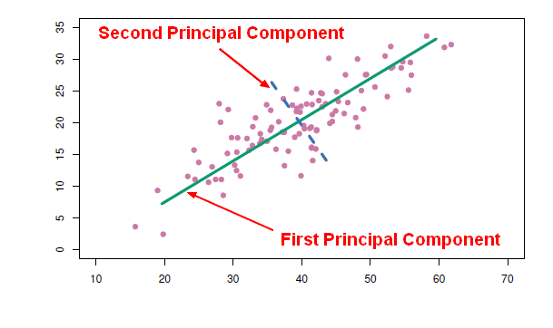

If you have reached my website, you likely know I spend A LOT of time using R and exploring all its capabilities – which are boundless.  Naturally, machine learning is a focus.  Not only is it insanely popular right now, it is a great deal of fun to learn what your data can tell you.  (I also use it to provide data stories to drive data-driven decision making at work rather than rely on the opinions of others!)  

The output of many algorithms are – wait for it – eigenvalues.  Does this term ring a bell from your past?  (I know it does for me after years of math at Johns Hopkins Engineering!)  Do you really remember what this is?  Admittedly, I have become so used to seeing the output and drawing conclusions from the data that I ignored what the eigenvalue results really meant.  That is the focus of this brief article.  And guess what – eigenvalues only sound mysterious.  The concept behind them is simple!

When do I commonly see eigenvalues?  Because much of the work I do includes high dimensional data (that simply means lots of columns), I use PCA – Principle Component Analysis.  (I actually use a number of methods to dimensional reduction but I’ll save that for a later article.)

PCA is a method of extracting important column variables (components) from a large set of variables in a data set.  PCA reduces the number of columns in a data set - it reduces the data down into its basic components by stripping away unnecessary parts.  (For those that recall more math than I, a more concise definition might be:  *Principal Component Analysis allows you to identify the principal mode of variation in your sample. Those modes are empirically calculated as the eigenvectors of your sample's covariance matrix (the "loadings")*. 

OK, the hard part is over – and it really is not hard.  Let’s really understand eigenvalues and their association with PCA.  Let’s look at the plot presented below. 

```{r out.width = "500px", echo=FALSE}

```
 
Principal components represent the underlying structure in data. They are the direction where there is the most variance - where the data is most spread out.  The green line below illustrates this concept.  The green line is where most of the variance Is found.  Because this line is the largest one that can be drawn, it is the principal component.  See, the concept is simple even if some of the nomenclature sounds overly-academic.

Let’s take it one more step.  Do you understand why the blue line is the 2nd principal component?  Sure you do.  It is the 2nd longest line through the data.  See – easy as pie!

Now we understand a little about principal components.  What does this have to do with eigenvalues?  I am glad you asked!

It would be a painful exercise to find the longest line through a set of data to find the principal components.  That is where eigenvalues help you.  They identify the lines and the variance represented by these lines for you!

First, understand that eigenvalues and eigenvectors always exist in pairs – you cannot have one without the other.  These two terms simply are fancy names for a direction and a value. 

In the plot, the eigenvector is the direction of the green line.  An eigenvalue is a number telling you how much variance (how spread out the data is) there is in the data in that direction.  The eigenvector with the highest eigenvalue is therefore the principal component.  Simple!

So we now know eigenvectors are simply directions in data describing the most variance in data.  We also know eigenvalues are numbers that measure the actual variance.  Simple as pie!

If you want to learn how to use PCA in R, search my site or take a look at this [article](http://statmath.wu.ac.at/~hornik/QFS1/principal_component-vignette.pdf)

Thanks for listening.

